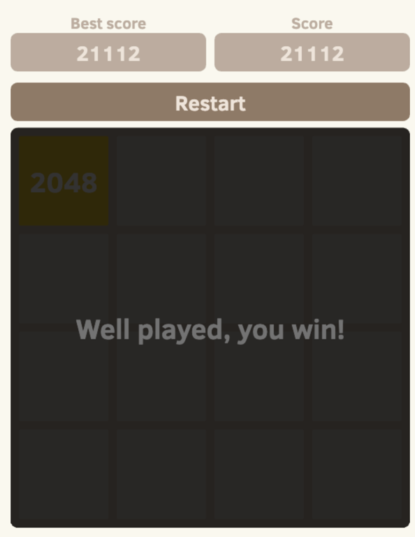

# Игра: 2048

"2048" - пет проект для практики JS, вдохновленный популярной игрой [2048][2048-game], написанной итальянским разработчиком [Габриэле Чирулли][2048-author]. 

## Правила игры в 2048

2048 играется на сетке 4 × 4 с числами равным значениям степеней двойки.

Каждый ход, с помощью стрелок, игрок должен выбрать направление в какую сторону сместить все числа.

В стандартной версии игры таких направления всего 4: вверх, вправо, вниз, влево.

После выбора направления плитки будут пытаться максимально сдвинуться в выбранном направлении, пока их не остановит либо другая плитка, либо край сетки.

Если две плитки с одинаковым числом столкнутся во время перемещения, они сольются в плитку с общим значением двух столкнувшихся плиток.

Результирующая плитка не может снова слиться с другой плиткой за один и тот же ход.

Каждый ход, новая плитка будет случайным образом появляться в пустом месте на доске. 

Плитка может появиться только в двух значения: 2 - с шансом 90% и 4 с шансом 10%.

Игра заканчивается поражением, если нет возможности совершить ход.

Цель игры сложить максимально большое число игры. 

## Подсчет рейтинга

В игре ведется подсчет очков, которые каждый ход увеличиваются на количество равное числу результирующей плитки.

## Победа

Победой считается, когда на поле появляется число 2048(2 в 20 степени). После этого игру все еще можно продолжить.

## Игра заканчивается

Когда на поле не осталось места для новых тайлов и все существующие тайлы невозможно совместить.

## При разработке планируется использовать технологии:
- [HTML5][html]
- [CSS3][css]
- [JavaScript][js]
- [TypeScript][ts]
- [Webpack][webpack]

&copy; Автор - [Сутужко Богдан][author-github]

[//]: # 'Общие переменные автора'
[author-github]: https://github.com/julfy-bs

[//]: # 'Общие переменные проекта'
[2048-game]: https://github.com/gabrielecirulli/2048
[2048-author]: https://github.com/gabrielecirulli
[//]: # 'Переменные используемых технологий'
[html]: https://html5.org/
[css]: https://www.w3.org/Style/CSS/Overview.en.html
[js]: https://www.javascript.com/
[ts]: https://www.typescriptlang.org/
[webpack]: https://webpack.js.org/
